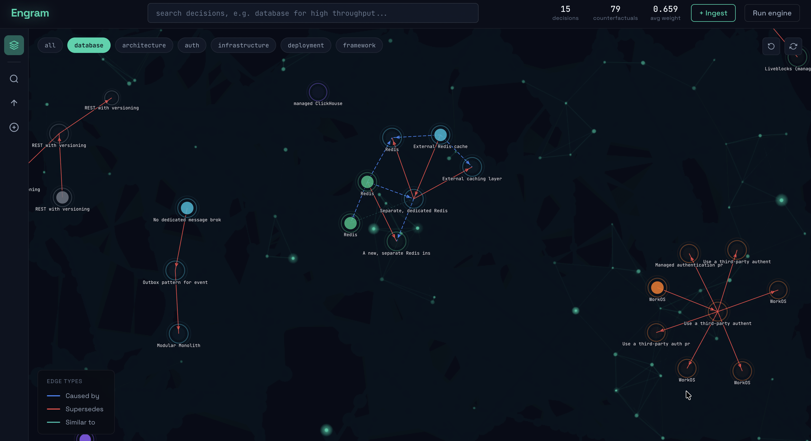

<div align="center">



# Engram

**Developer decision intelligence — causal memory across AI sessions.**

Every technical decision you make with AI tools. Every rejected alternative. Every reason why. Remembered permanently, retrieved semantically, visualized as a living knowledge graph.

[](https://github.com/bitphonix/Engram/actions/workflows/ci.yml)
[](https://github.com/bitphonix/Engram/actions)
[](https://python.org)
[](LICENSE)
[](https://langchain-ai.github.io/langgraph/)
[](https://neo4j.com/cloud/aura)

[**Live Demo**](https://engram-xxxxx.ondigitalocean.app) · [**Setup Guide**](SETUP.md) · [**Report Bug**](https://github.com/bitphonix/Engram/issues)

</div>

---

> **Demo** — add a GIF here once recorded. Run `asciinema rec` or QuickTime to capture:
> `engram install` → ingest a session → `engram search` → open dashboard graph
> Drop the file at `assets/demo.gif` and replace this line with:
> ``

---

## The problem

Every AI coding session ends with lost context. You close the chat — the decisions, the dead ends, the reasoning behind every choice — evaporate. Tomorrow you start over.

Existing tools store *what happened*. Engram stores *what you decided, what you rejected, and why*:

| Tool | What it stores | What it misses |
|---|---|---|
| claude-mem | Tool outputs within a session | Rejected alternatives, cross-project patterns |
| mem0 | Facts and preferences | The *why* behind decisions, counterfactuals |
| Chat history | Everything | Signal in the noise, cross-session intelligence |

**The insight:** When you chose PostgreSQL over MongoDB, the *rejection* carries more information than the choice. The concern that drove it, the constraints, the reasoning — that's the engineering judgment that should survive session boundaries. Engram stores what no other system does: **the roads not taken.**

---

## Quickstart

```bash
git clone https://github.com/bitphonix/Engram
cd Engram
python -m venv venv && source venv/bin/activate
pip install -e .

# Copy and fill in your secrets (see SETUP.md for step-by-step)
cp .env.example .env

# One-command setup — wires up Claude Code, Cursor, VS Code + auto-capture
engram install

# Start server (persists across reboots via launchd on macOS)
engram start
```

Open [http://localhost:8000](http://localhost:8000)

See **[SETUP.md](SETUP.md)** for full instructions including Neo4j AuraDB and Gemini API key setup.

---

## CLI

```
engram start              Start server as background daemon
engram stop               Stop the server
engram status             Live server health + knowledge graph stats
engram search <query>     Semantic search over your decision history
engram install            Configure MCP for Claude Code, Cursor, VS Code
engram capture            Capture from stdin — pipe any conversation
engram delete <id>        Remove a decision from graph + vector store
engram retry              Retry failed ingests from the local queue
engram service install    Install launchd service — auto-starts on login (macOS)
engram service uninstall  Remove the launchd service
```

### Examples

```bash
# Search across all your past decisions semantically
engram search "database for high throughput analytics"
→ ● Chose managed ClickHouse over PostgreSQL, Kafka, BigQuery
    id: cb5b0db3 · database · analytics_platform · score: 0.714

# Check graph health
engram status
→ Active decisions    36
→ Counterfactuals     54
→ Sessions            13
→ Avg weight          0.643

# Capture any conversation from stdin
cat conversation.txt | engram capture --project my-api --tool claude
```

---

## MCP integration — Claude Code, Cursor, VS Code

`engram install` configures all three tools simultaneously. After setup:

```
"Capture this session to Engram"           → saves decisions + counterfactuals to graph
"What does Engram know about databases?"   → 4-level causal retrieval
"Have I rejected Kafka before?"            → surfaces past rejections with reasons
"Show my Engram graph stats"               → live knowledge graph health
```

Claude Code captures sessions **automatically** — Engram injects rules into `~/.claude/CLAUDE.md` so capture happens at session end without prompting.

| Tool | Config location |
|---|---|
| Claude Code | `~/.claude/settings.json` |
| Cursor | `~/.cursor/mcp.json` |
| VS Code | `.vscode/mcp.json` (uses `"servers"` key) |

---

## How it works

### Extraction pipeline (LangGraph)

```
Raw session content
        ↓
  triage_node      →  Is this high-signal or noise? (Gemini Flash)
        ↓
  extractor_node   →  Extract atomic decisions + counterfactuals (Gemini Pro)
        ↑_____________retry (up to 2x if critique score < 7)
  critique_node    →  Score extraction quality 0-10 (Gemini Flash)
        ↓
  graph_writer     →  Write to Neo4j + embed to ChromaDB + run linker
```

### The knowledge graph (Neo4j)

Three node types, five relationship types:

```
Decision node          → what was chosen, why, situation context, epistemic weight
Counterfactual node    → what was rejected, rejection reason, rejection concern
Session node           → metadata: tool, project, timestamp, content hash

CAUSED_BY    → new decision explicitly builds on a prior one
SUPERSEDES   → newer decision replaces older in same domain/project
SIMILAR_TO   → semantically similar across projects (score > 0.87)
CONTRADICTS  → same option chosen in one project, rejected in another
REJECTED_IN  → counterfactual belongs to a decision
```

### 4-level causal retrieval

```
Level 1  Semantic search (ChromaDB, local)
         → cosine similarity across all 768-dim embeddings
           finds related decisions by meaning, not domain keyword

Level 2  Causal ancestry (Neo4j)
         → traverses CAUSED_BY edges upstream
           "what decisions led to this one?"

Level 3  Full episode (Neo4j)
         → decision + all counterfactuals + outcomes
           complete context for each relevant decision

Level 4  Counterfactual surface
         → "You rejected X in 3 similar situations. Here's why."
           nobody else has this layer
```

### Epistemic weight engine

Decisions are not equally trustworthy. The engine runs asynchronously:

- **Time decay** — `W(t) = W₀ · e^(-λt)` where λ is assigned at extraction time (0.01 for architecture → 0.30 for trivial preferences)
- **Override signal** — newer decisions in same domain/project decay older ones via `SUPERSEDES`
- **Propagation boost** — retrieved and reused decisions gain weight (+0.05)
- **Contradiction detection** — option chosen in one project, rejected in another → `CONTRADICTS` edge

Good decisions solidify. Bad ones fade. No manual intervention required.

### Local-first architecture

- Vector embeddings stored at `~/.engram/chroma` (ChromaDB) — no cloud dependency, no IP whitelisting
- Failed ingests queued to `~/.engram/queue/` — nothing lost when Gemini is down
- Duplicate detection via SHA-256 content hash — same session never ingested twice
- Server persists across reboots via launchd — always running in background

---

## Architecture

```
┌─────────────────────────────────────────────────────┐
│  Capture Layer                                      │
│  MCP (Claude Code · Cursor · VS Code)               │
│  Manual paste · engram capture · Bookmarklet        │
└───────────────────────┬─────────────────────────────┘
                        ↓
┌─────────────────────────────────────────────────────┐
│  LangGraph Extraction Pipeline                      │
│  triage → extract → critique → write → link         │
│              ↑__________(reflection loop)____|      │
└───────────────────────┬─────────────────────────────┘
                        ↓
┌──────────────────────┐  ┌──────────────────────────┐
│  Neo4j AuraDB        │  │  ChromaDB (local)        │
│  Causal graph        │  │  Vector embeddings       │
│  Decision + CF nodes │  │  ~/.engram/chroma        │
│  Typed edges         │  │  Gemini text-embedding   │
└──────────┬───────────┘  └────────────┬─────────────┘
           └──────────────┬────────────┘
                          ↓
┌─────────────────────────────────────────────────────┐
│  4-Level Causal Retrieval                           │
│  L1 semantic → L2 ancestry → L3 episode → L4 CF     │
└───────────────────────┬─────────────────────────────┘
                        ↓
┌─────────────────────────────────────────────────────┐
│  Injection Layer                                    │
│  MCP context provider · Briefing · engram search    │
└─────────────────────────────────────────────────────┘
```

---

## Tech stack

| Layer | Technology | Why |
|---|---|---|
| Agent framework | LangGraph 0.2 | Conditional edges, stateful pipeline, reflection loop |
| LLM | Google Gemini 2.5 Pro / Flash | Pro for extraction quality, Flash for triage speed |
| Graph database | Neo4j AuraDB Free | Native graph traversal, typed relationships, causal queries |
| Vector store | ChromaDB (local) | Zero network dependency, works on any wifi |
| API | FastAPI | Async, auto-docs, Pydantic validation |
| CLI | Python (argparse + setup.py) | `engram install` wires all three AI tools at once |
| MCP server | Python stdio | Passive capture from Claude Code, Cursor, VS Code |
| Observability | Datadog APM + Sentry | Full trace per pipeline run, real-time error capture |
| Secret management | Doppler / python-dotenv | Zero hardcoded credentials |

---

## Agentic patterns demonstrated

- **Multi-node LangGraph pipeline** — 5 specialized nodes with shared TypedDict state
- **Triage gate** — cheap Flash model blocks noise before expensive Pro extraction
- **Self-correction loop** — Critique node scores quality, routes back to extractor on failure
- **Knowledge graph write** — typed Neo4j nodes with causal relationship edges created automatically
- **Decision linker** — CAUSED_BY, SUPERSEDES, SIMILAR_TO edges via semantic similarity
- **Causal graph traversal** — 4-level retrieval agent traverses ancestry chains
- **Epistemic weight engine** — async background process evolves node weights over time
- **MCP server (stdio)** — works across Claude Code, Cursor, VS Code simultaneously
- **Local-first vector search** — ChromaDB replaces hosted Atlas, zero network dependency
- **Persistent daemon** — launchd service auto-starts on macOS login
- **Retry queue** — failed ingests saved to `~/.engram/queue/`, never lost
- **Content deduplication** — SHA-256 hash prevents re-ingesting the same session

---

## What makes it different from claude-mem and mem0

**vs claude-mem:** claude-mem captures everything that happens in a Claude Code session via hooks — every tool call, every file edit. It answers *what happened*. Engram captures *why you decided something and what you rejected*. Engram is cross-project and cross-tool (Claude Code + Cursor + VS Code + any tool via paste/bookmarklet). claude-mem is Claude Code only.

**vs mem0:** mem0 is an SDK you embed into your own application. Engram is a personal tool you install once and it works on top of every AI tool you already use. mem0 stores facts. Engram stores causal decision graphs with epistemic weights that evolve over time.

---

## Running tests

```bash
pytest tests/ -v
# 64 tests — queue, vector_client, linker, API endpoints, CLI commands
```

---

## Running locally

**Prerequisites:** Python 3.11+, Neo4j AuraDB free account, Gemini API key

```bash
git clone https://github.com/bitphonix/Engram
cd Engram
python -m venv venv && source venv/bin/activate
pip install -e .
cp .env.example .env
# Fill in: NEO4J_URI, NEO4J_USER, NEO4J_PASSWORD, GEMINI_API_KEY
engram start
```

Full step-by-step: **[SETUP.md](SETUP.md)**

---

## Roadmap

- [ ] Browser extension — native capture from Claude.ai, ChatGPT, Gemini web
- [ ] FS watcher — capture IDE file changes as outcome signal
- [ ] Local SLM triage — replace cloud Flash with ONNX, zero API cost
- [ ] Git signals — git stability updates epistemic weights automatically
- [ ] Team sync — shared knowledge graph for engineering teams
- [ ] Outcome feedback loop — automatic weight updates from real-world results

---

<div align="center">

Built by [Tanishk Soni](https://linkedin.com/in/tanishk-soni-a94077239) · [GitHub](https://github.com/bitphonix)

</div>